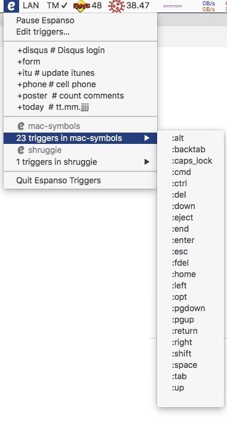
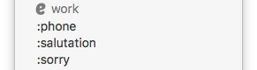
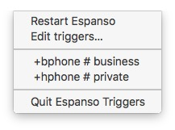

# Espanso Triggers
[Espanso](https://espanso.org/) lacks a menu with all user defined triggers. 
**Espanso Triggers** is a tiny companion script to list all user defined triggers in the Mac OS X menu bar.
[Platypus](https://sveinbjorn.org/platypus) is used to create a menulet from the bash script.

## Features
* replaces the Espanso menulet
* pause and restart the Espanso service from the menu
* the Espanso YAML file can be edited from the menu
* triggers can be selected and started directly from the menu
* supports multiple YAML trigger files
* lists all user defined triggers
* optional comments to a trigger
* lists installed [Espanso Packages](https://hub.espanso.org/) in sub-menus
* each sub-menu is labeled with a small Espanso 'e' and the package name

### Espanso Triggers Menu with one or multiple yml files
 

### Espanso Triggers Menu with package sub menu

## Download and install
Download the latest version of EspansoTriggers.zip from [Releases](https://github.com/einstweilen/espanso-triggers/releases/).
Unzip the file and place it somewhere in your Applications folder.

## How to use
Double click the **Espanso Triggers** app and a small Espanso 'e' is added to the menu bar. Click on the 'e' to see a list of all of your triggers.
If you want to start **Espanso Triggers** on every boot, add it to your login items (Apple menu > System Preferences > Users & Groups > Login Items)

## How to remove the now superfluous old Espanso 'e'
The standard Espanso menulet is no longer needed as all functions are included in **Espanso Triggers**.
If you want to hide the original menulet select "Edit triggers…" and the default YAML file is opened. 
Add `show_icon: false` at the top of the file and save the changes. 
After restarting Espanso (select the *Pause Espanso* menu item and afterwards the *Restart Espanso* menu item) only the **Espanso Triggers** 'e' will be displayed.  

## Multiple trigger files
When there are more than one YAML trigger file in the Espanso directory `Preferences/espanso` the triggers will be listed in groups with the filename as group name e.g `work.yml` becomes

## How to add comments to triggers
To help you to memorize your different triggers a short comment can be added right after the trigger

`trigger: "+hphone" # private`

`trigger: "+bphone" # business`

## How to use your own text editor
*Edit triggers…* opens the file ‘default.yml‘ in the standard text editor.

To use your own editor change the *open -e* command in line #15 of *Espanso Triggers.app/Contents/Resources/script* to ‘open -a "YourEditor" -e $HOME/Library/Preferences/espanso/default.yml‘.

e.g. if you want to use [Visual Studio Code](https://code.visualstudio.com/)
`open -a "Visual Studio Code" -e $HOME/Library/Preferences/espanso/default.yml`

## History
2021-04-22 Initial Release

2021-05-05 NEW group triggers by file, FIX remove empty line from package sub menu

### Disclaimer
The menulet is provided as is. It is tested under OS X 10.13 High Siera
Espanso and Playtypus are open source software, you can make a donation to the developers on their websites.

### Reference 
[Espanso](https://espanso.org/) by Federico Terzi is an open-source cross-platform (Win/Mac/Linux) text expander  

[Platypus](https://sveinbjorn.org/platypus) by Sveinbjorn Thordarson creates native Mac applications from command line scripts such as shell scripts or Python, Perl, Ruby, Tcl, JavaScript and PHP programs.
