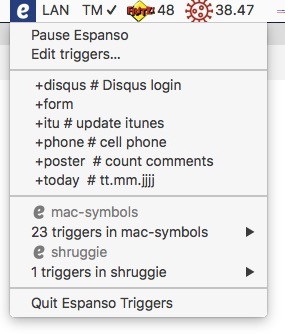

# Espanso Triggers
[Espanso](https://espanso.org/) lacks a menu with all user defined triggers. 
**Espanso Triggers** is a tiny 50 LOC companion script to list all user defined triggers in the Mac OS X menu bar.
[Platypus](https://sveinbjorn.org/platypus) is used to create a menulet from the bash script.

## Features
* replaces the Espanso menulet completly
* pause and restart the Espanso service from the menu
* lists all user defined triggers
* add optional comments to a trigger
* triggers can be selected and started directly from the menu
* installed [Espanso Packages](https://hub.espanso.org/) are listed in sub-menus
* each sub-menu is labeled with a small Espanso 'e' and the package name
* the Espanso YAML file can be edited from the menu

### Espanso Triggers Menu

### Espanso Triggers Menu with sub menu

## Download and install
Download the latest version of EspansoTriggers.zip from [Releases](https://github.com/einstweilen/espanso-triggers/releases/).
Unzip the file and place it somewhere in your Applications folder.

## How to use
Double click the **Espanso Triggers** app and a small Espanso 'e' is added to your menu bar. Click on the 'e' to see all your triggers.
If you want to start **Espanso Triggers** on every boot, add it to your login items (Apple menu > System Preferences > Users & Groups > Login Items)

## How to remove the now superfluous old Espanso 'e'
The standard Espanso menulet is no longer needed as all functions are included in **Espanso Triggers**.
If you want to hide the original menulet select "Edit triggers…" and the YAML file with all you triggers is opened. 
Add `show_icon: false` at the top of the file and save the changes. 
After restarting Espanso (select the *Pause Espanso* menu item and afterwards the *Restart Espanso* menu item) only the **Espanso Triggers** 'e' will be displayed.  

## How to add comment to trigger
To help you to memorize your different triggers a short comment can be added right after the trigger

`trigger: "+hphone" # private`
`trigger: "+bphone" # business`

Every text after the # is shown in the menu

## How to use your own text editor
You may want to change the default editor. I am using [Visual Studio Code](https://code.visualstudio.com/) to edit all my text files. To edit your YAML files with another editor from the *Edit triggers…* menu you have to change the *open -a* command in line #12 of *Espanso Triggers.app/Contents/Resources/script*

‘open -a "Visual Studio Code" -e $HOME/Library/Preferences/espanso/default.yml‘

Disclaimer
The menulet is provided as is. It is tested under OS X 10.13 High Siera
Espanso and Playtypus are open source software, you can make a donation to the developers on their websites.

### Reference 
[Espanso](https://espanso.org/) by Federico Terzi is an open-source cross-platform (Win/Mac/Linux) text expander  

[Platypus](https://sveinbjorn.org/platypus) by Sveinbjorn Thordarson creates native Mac applications from command line scripts such as shell scripts or Python, Perl, Ruby, Tcl, JavaScript and PHP programs.
